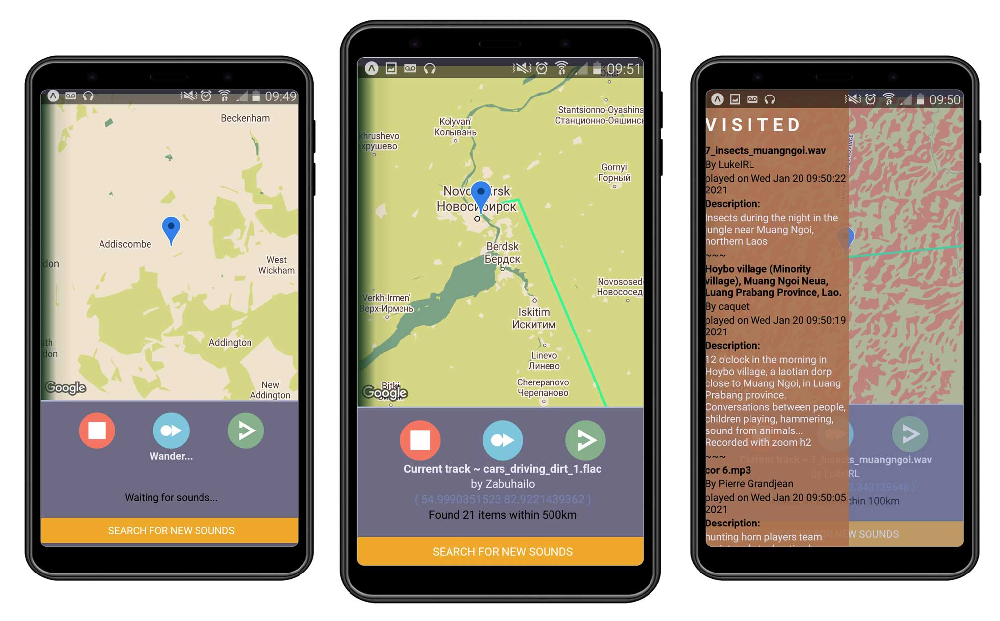

<p align="center">
  
</p>

**Wandrer** is a cross-platform sound streaming app for geotagged field recordings from the [Freesound library](https://freesound.org/ "Freesound page"), letting the user explore places near and far through an archive of sound.

By selecting a location in the world, **Wandrer** generates a playlist of sounds recrded nearby using geocoordinates, and moves the user to each location as the sounds are played, creating an associative audio journey that is drawn on the screen in a generative path.

## Screenshots
<p align="center">
  
</p>

## Getting started

### Token

Wandrer requires an API key from freesound in order to query their sound library. This requires a Freesound account, which is free, after which the application for an API key is usually immediately accepted. Follow this link to apply for the key:
[Freesound API key](https://freesound.org/apiv2/apply)

After recieving the key, it will need to be placed in the `.env` file after installation.

### Installation

1. Clone the repo

```
git clone https://github.com/awenine/wandrer.git
cd wandrer
```

2. Install dependencies
```
npm install
```

3. Start development server
```
npm start
```
4. Insert Freesound API token into `.env` file in this format
```
TOKEN= *API key here*
```
5. Scan the barcode with the Expo app on your phone or follow the terminal instructions to load up the emulator on your machine.

## Built with

* [React Native](https://facebook.github.io/react-native) - Front end library for building user interfaces
* [React Navigation](https://reactnavigation.org) - Routing and *navigation* for *React* Native apps
* [Expo](https://expo.io) - Build cross-platform native apps
* [Freesound API](https://freesound.org/) - Collaborative database of Creative Commons Licensed sounds.
* [React Native Maps](https://github.com/react-native-maps/react-native-maps) - For rendering Map navigation via Google Maps 
* Thousands of users archiving a world of sound over 15 years 


## Contributing

All contributions are welcome :-)


## Author

Christopher Owen - [Github](https://github.com/awenine)


## License

This project is licensed under the MIT License.
